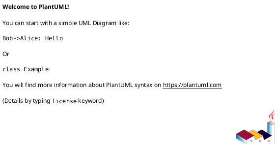
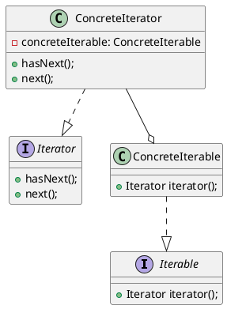

# Creational design patterns

クラスやオブジェクトの作成パターン

<details><summary>Abstract Factory</summary>

## Abstract Factory

</details>

<details><summary>Builder</summary>

## Builder

</details>

<details><summary>Factory Method</summary>

## Factory

</details>

<details><summary>Object Pool</summary>

## Object

</details>

<details><summary>Prototype</summary>

## Prototype

</details>

<details><summary>Singleton</summary>

## Singleton

</details>

# Structural design patterns

クラスやオブジェクトの構成パターン

<details><summary>Adapter</summary>

## Adapter

クラスのインターフェースをクライアントが期待する別のインターフェースに

変換することで、互換性がない他のクラスを連携する。



</details>

<details><summary>Bridge</summary>

## Bridge

</details>

<details><summary>Composite</summary>

## Composite

</details>

<details><summary>Decorator</summary>

## Decorator

</details>

<details><summary>Facade</summary>

## Facade

</details>

<details><summary>Flyweight</summary>

## Flyweight

</details>

<details><summary>Private Class Data</summary>

## Private Class Data

</details>

<details><summary>Proxy</summary>

## Proxy

</details>

# Behavioral design patterns

クラスやオブジェクト間のコミュニーケーションパターン

<details><summary>Chain of responsibility</summary>

## Chain of responsibility

</details>

<details><summary>Command</summary>

## Command

</details>

<details><summary>Interpreter</summary>

## Interpreter

</details>

<details><summary>Iterator</summary>

## Iterator

集約クラスに順番にアクセスする方法を提供する。



### 例

<details><summary>iterator in java</summary>

```java
class IntegerBox {
    private List<Integer> list = new ArrayList<>();

    public class Iterator {
        private IntegerBox box;
        private java.util.Iterator iterator;
        private int value;

        public Iterator(IntegerBox integerBox) {
            box = integerBox;
        }

        public void first() {
            iterator = box.list.iterator();
            next();
        }

        public void next() {
            try {
                value = (Integer)iterator.next();
            } catch (NoSuchElementException ex) {
                value =  -1;
            }
        }

        public boolean isDone() {
            return value == -1;
        }

        public int currentValue() {
            return value;
        }
    }

    public void add(int in) {
        list.add(in);
    }

    public Iterator getIterator() {
        return new Iterator(this);
    }
}

public class IteratorDemo {
    public static void main(String[] args) {
        IntegerBox integerBox = new IntegerBox();
        for (int i = 9; i > 0; --i) {
            integerBox.add(i);
        }
        // getData() has been removed.
        // Client has to use Iterator.
        IntegerBox.Iterator firstItr = integerBox.getIterator();
        IntegerBox.Iterator secondItr = integerBox.getIterator();
        for (firstItr.first(); !firstItr.isDone(); firstItr.next()) {
            System.out.print(firstItr.currentValue() + "  ");
        }
        System.out.println();
        // Two simultaneous iterations
        for (firstItr.first(), secondItr.first(); !firstItr.isDone(); firstItr.next(), secondItr.next()) {
            System.out.print(firstItr.currentValue() + " " + secondItr.currentValue() + "  ");
        }
    }
}
```

</details>

</details>

<details><summary>Mediator</summary>

## Mediator

</details>

<details><summary>Memento</summary>

## Memento

</details>

<details><summary>Null Object</summary>

## Null Object

</details>

<details><summary>Observer</summary>

## Observer

</details>

<details><summary>State</summary>

## State

</details>

<details><summary>Strategy</summary>

## Strategy

</details>

<details><summary>Template method</summary>

## Template method

</details>

<details><summary>Visitor</summary>

## visitor

</details>
