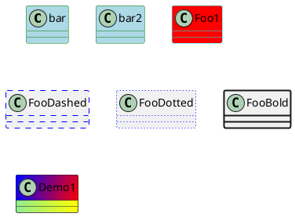

# クラス図

クラス間の関係を表す図。

```uml
@startuml
[<class>]
[note]
<arrow>
[<class_name> :]
[<show_or_hide>]
[remove]
[package]
[namespace]
@enduml
```

## 属性

<details><summary>&lt;class&gt;</summary>

### &lt;class&gt;

クラスの定義

|class|説明|
|:---|:---|
|abstract|抽象クラス|
|annotation|注釈|
|circle|円|
|()|小さい円|
|class|一般的なクラス|
|diamond|ひし形|
|&lt;&gt;|小さいひし形|
|enum|列挙型|
|entity|実態|
|interface|インタフェース|

```puml
<class> {<class_name> | "<class_name>" as} [\<\<<[(<I>,#<color>)]streotype>\>\>] [\<<generics>>\>] [#color] [\{
    [<visibility>] [\{<category>\}] {<field> | <method>()}[: <type>]
    [...]
    [..]  ' ここで..は繰り返しを示さない。
    [==]
\}]
```

#### 属性

<details><summary>as</summary>

##### as

```puml
as <alias>
```

</details>

<details><summary>&lt;visibility&gt;</summary>

##### &lt;visibility&gt;

|visibility||
|:---|:---|
|-|private|
|#|protected|
|~|package private|
|+|public|

```puml
<visibility>
```

</details>

<details><summary>&lt;category&gt;</summary>

##### &lt;category&gt;

明示的に次を指定できます。

|category|説明|
|:---|:---|
|field|フィールド|
|method|メソッド|
|static|静的|
|abstract|抽象|

```puml
<category>
```

</details>

<details><summary>..</summary>

##### ..

点線で区切る。

```puml
..[<message>..]
```

</details>

<details><summary>==</summary>

##### ==

二重線で区切る

```puml
==[<message>==]
```

</details>

#### 例

<details><summary>スタイルの変更</summary>

##### スタイルの変更



</details>

</details>

<details><summary>&lt;arrow&gt;</summary>

### &lt;arrow&gt;

クラスの関係

|arrow|説明|
|:---|:---|
|&lt;&#124;--|汎化、特化(継承)|
|&lt;&#124;..|実現(実装)|
|*--|合成|
|o--|集約|
|&lt--|関連|
|&lt..|依存|
|#||
|x--||
|}--||
|+--|パッケージ同士の親子関係|
|^--||

```puml
<class_name>[::{<method>() | field}] ["<message1>"] <arrow> ["message2"] <class_name>[::{method | field}] [#<color>]: [\<] <message3> [\>]
```

#### 備考

<details><summary>汎化、特化</summary>

##### 汎化

サブクラスとスーパークラスの関係で

サブクラスからスーパークラスを汎化、

スーパークラスからサブクラスを特化。

```puml
SubClass --|> SuperClass
```

</details>

<details><summary>実現</summary>

##### 実現

クラスがインタフェースを実装すること。

```puml
Implemention ..|> Specialization
```

</details>

<details><summary>関連</summary>

##### 関連

集約関係のない意味論的関係

</details>

<details><summary>合成</summary>

##### 合成

完全な集約をあらわし、集約してる側のオブジェクトが消去されたら、

集約されているオブジェクトも消える関係。

```puml
CompositeElement *-- ComposedElement
```

</details>

<details><summary>集約</summary>

##### 集約

どちらかの要素がもう一方を共有している関連

```puml
AggregatingElement o-- AggregatedElement
```

</details>

#### 例

<details><summary>矢印のスタイル</summary>

##### 矢印のスタイル

```puml
@startuml
title Bracketed line style mix
class foo
class bar
bar1 : [#red,thickness=1]
bar2 : [#red,dashed,thickness=2]
bar3 : [#green,dashed,thickness=4]
bar4 : [#blue,dotted,thickness=8]
bar5 : [#blue,plain,thickness=16]
foo --> bar
foo -[#red,thickness=1]-> bar1 : [red,1]
foo -[#red,dashed,thickness=2]-> : [red,dashed,2]
foo -[#green,dashed,thickness=4]-> : [grean,dashed,4]
foo -[#blue,dotted,thickness=8]-> : [blue,dotted,8]
foo -[#blue,plain,thickness=16]-> : [blue,plain,16]

@enduml

@startuml
class foo
foo --> bar : normal
foo --> bar1 #line:red;line.bold;text:red : red bold
foo --> bar2 #green;line.dashed;text:green : green dashed
foo --> bar3 #blue;line.dotted;text:blue : blue dotted
@enduml
```

</details>

</details>

<details><summary>&lt;class_name&gt; :</summary>

```puml
<class_name> : {<method>() | <field>}[: <type>]
```

</details>

<details><summary>note</summary>

### note

```puml
note {
    {left | right | top} [of | on link] [#<color>]
        {: {<message>} | <multi_line> end note}
    | "<message>" as
}
```

#### 属性

<details><summary>left</summary>

##### left

左側にノートをつける。

```puml
left
```

</details>

<details><summary>right</summary>

##### right

右側にノートをつける

```puml
right
```

</details>

<details><summary>top</summary>

##### top

上にノートをつける。

```puml
top
```

</details>

<details><summary>of</summary>

##### of

ノートをつけるクラスやメソッド、属性を指定する。

省略する場合、クラス定義の直後につける必要がある。

```puml
of <class_name>[::<method_or_field_name>]
```

</details>

<details><summary>as</summary>

参照するための名前をつける。

##### as

```puml
as <alias>
```

</details>

<details><summary>on link</summary>

##### on link

```puml
on link
```

リンクメッセージにノートをつける。

関係を示した文の直後に書く必要がある。

</details>

<details><summary>end note</summary>

##### end note

複数行のノートを記述したときの終わりを示す。

```puml
end note
```

</details>

</details>

<details><summary>&lt;show_or_hide&gt;</summary>

### &lt;show_or_hide&gt;

指定した属性を隠したり、表示する。

```puml
{show | hide} [class | interface | enum | <class_name> | @unlinked] [empty] {
    fields
    | methods
    | members
    | circle
    | stereotype
}
```

</details>

<details><summary>remove</summary>

### remove

クラスを削除

```puml
remove {<class_name> | @unlinked}
```

</details>

<details><summary>package</summary>

クラスをグループ化する。

### package

```puml
package {<class_name> | "<class_name>" as} [\<\<<stype>\>\>] #color {
    <expression>
    [...]
}
```

#### 属性

<details><summary>as</summary>

##### as

```puml
as <alias>
```
</details>

<details><summary>&lt;style&gt;</summary>

##### &lt;style&gt;

以下のスタイルを選ぶことができる。

- Node
- Rectangle
- Folder
- Frame
- Cloud
- Database


```puml
\<<style>\>
```

</details>

</details>

<details><summary>namespace</summary>

### namespace

パッケージ同士に同じクラス名が存在する場合に便利。

```puml
namespace <name> {
    <expression>
    [...]
}
```

#### 例

<details><summary>一般的な例</summary>

```puml
@startuml
class BaseClass
namespace net.dummy #DDDDDD {
.BaseClass <|-- Person
Meeting o-- Person
.BaseClass <|- Meeting
}
namespace net.foo {
net.dummy.Person <|- Person
.BaseClass <|-- Person
net.dummy.Meeting o-- Person
}
BaseClass <|-- net.unused.Person
@enduml
```

</details>

</details>
